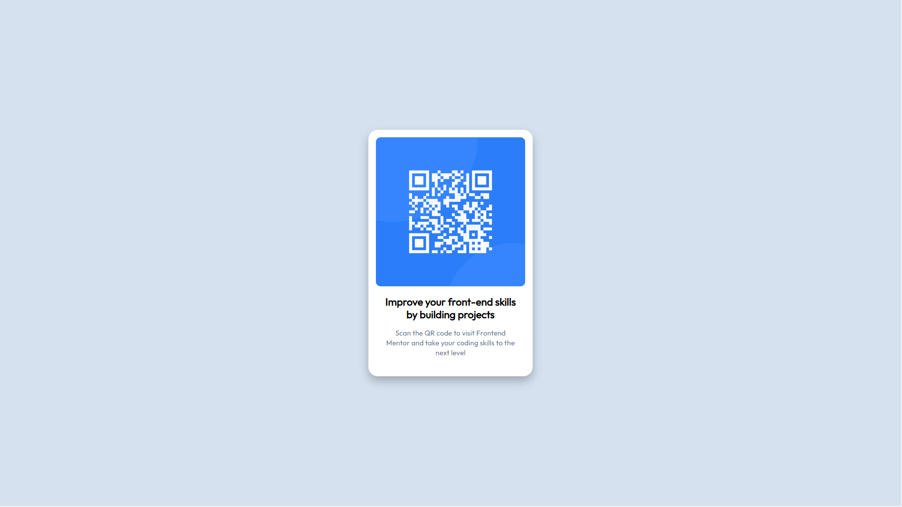

# Frontend Mentor - QR code component solution

This is a solution to the [QR code component challenge on Frontend Mentor](https://www.frontendmentor.io/challenges/qr-code-component-iux_sIO_H). Frontend Mentor challenges help you improve your coding skills by building realistic projects. 

## Table of contents

- [Overview](#overview)
  - [Screenshot](#screenshot)
  - [Links](#links)
- [My process](#my-process)
  - [Built with](#built-with)
  - [What I learned](#what-i-learned)
  - [Continued development](#continued-development)
  - [Useful resources](#useful-resources)
- [Author](#author)
- [Acknowledgments](#acknowledgments)

## Overview

### Screenshot

### Links

- My Live Solution URL: [https://angelalui724.github.io/qr-code/]

### Built with
- Semantic HTML5 markup
- CSS custom properties
- Flexbox
- Mobile-first workflow

### What I learned
This project helped me strengthen my understanding of fundamental web development concepts. I gained experience in creating a responsive design that looks clean and functional across different screen sizes. By focusing on semantic HTML and CSS, I improved my ability to structure and style components effectively.

I also practiced working with CSS for layout and alignment, which reinforced the importance of proper spacing, typography, and design consistency. Paying attention to the small details, like colors and font sizes, taught me how to bring a design to life in a way that matches the original layout closely.

Overall, this challenge was a great opportunity to refine my skills and build confidence in creating simple, reusable components.